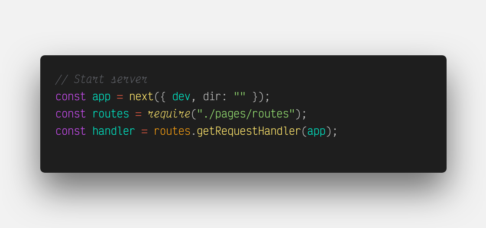

# IDE

## IntelliJ

## Visual StudioCode

I recently jumped to vsc for a new project. It is a verry good IDE that can be customized on good ways. 

At the moment I use Andromeda theme \(downloaded directly from vsc market place\).

I wanted to use a free font with ligatures and italics comments. I use [Victor Mono font](https://rubjo.github.io/victor-mono/) and this config in settings.json file in vsc : 

```text
"editor.tokenColorCustomizations": {
    "textMateRules": [
      {
        "name": "Comment",
        "scope": [
          "comment",
          "punctuation.definition.comment"
        ],
        "settings": {
          "fontStyle": "italic"
        }
      },
      {
        "name": "Keyword, Storage",
        "scope": [
          "Keyword",
          "Storage"
        ],
        "settings": {
          "fontStyle": "italic"

        }
      },
      {
        "name": "Keyword Control",
        "scope": [
          "keyword.control"
        ],
        "settings": {
          "fontStyle": "italic"
        }
      },
      {
        "scope": "entity.other.attribute-name",
        "settings": {
          "fontStyle": "italic"
        }
      },
      {
        "name": "entity.name.method.js",
        "scope": [
          "entity.name.method.js"
        ],
        "settings": {
          "fontStyle": "italic"
        }
      },
      {
        "name": "Language methods",
        "scope": [
          "variable.language"
        ],
        "settings": {
          "fontStyle": "italic"
        }
      },
      {
        "name": "HTML Attributes",
        "scope": [
          "text.html.basic entity.other.attribute-name.html",
          "text.html.basic entity.other.attribute-name"
        ],
        "settings": {
          "fontStyle": "italic"
        }
      },
      {
        "name": "Decorators",
        "scope": [
          "tag.decorator.js entity.name.tag.js",
          "tag.decorator.js punctuation.definition.tag.js"
        ],
        "settings": {
          "fontStyle": "italic"
        }
      },
      {
        "name": "ES7 Bind Operator",
        "scope": [
          "source.js constant.other.object.key.js string.unquoted.label.js"
        ],
        "settings": {
          "fontStyle": "italic"
        }
      },
      {
        "name": "Markup - Italic",
        "scope": [
          "markup.italic"
        ],
        "settings": {
          "fontStyle": "italic"
        }
      },
      {
        "name": "Markup - Bold-Italic",
        "scope": [
          "markup.bold markup.italic",
          "markup.italic markup.bold",
          "markup.quote markup.bold",
          "markup.bold markup.italic string",
          "markup.italic markup.bold string",
          "markup.quote markup.bold string"
        ],
        "settings": {
          "fontStyle": "bold"
        }
      },
      {
        "name": "Markup - Quote",
        "scope": [
          "markup.quote"
        ],
        "settings": {
          "fontStyle": "italic"
        }
      },
      {
        "scope": "variable.other",
        "settings": {
        }
      },
      {
        "scope": "entity.name.function",
        "settings": {
        }
      },
      {
        "scope": "support.function",
        "settings": {
          "fontStyle": "italic"
        }
      },
      {
        "scope": "string",
        "settings": {
        }
      },
    ]
  },
```

Result : 




